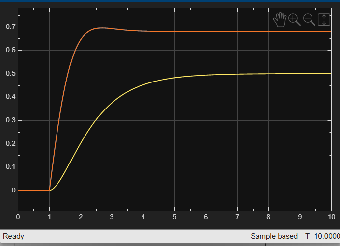

#  Adaptive Active Suspension Control System

##  Overview

This project presents an **Adaptive Active Suspension Control System** developed using **MATLAB** and **Simulink** to improve vehicle ride comfort and stability under different road disturbances.

Conventional suspension systems often experience excessive oscillations and poor damping when vehicles encounter potholes, speed breakers, or rough terrain. To address this issue, a **PD-controlled active suspension system** was designed and compared against a normal uncontrolled suspension system.

The project combines:
- Real-time suspension animation
- Live response visualization
- Performance analysis dashboard
- Multiple road condition simulations
- Simulink-based control modeling

to create an interactive and engineering-focused suspension analysis platform.

---

#  Objectives

- Reduce vehicle body oscillations
- Improve ride comfort
- Minimize settling time
- Improve damping performance
- Analyze suspension behavior under different road conditions
- Compare controlled and uncontrolled systems

---

#  Key Features

##  Real-Time Suspension Animation
A moving vehicle animation was created to visually demonstrate suspension behavior while passing over road disturbances.

The simulation compares:
-  Without Controller
-  Adaptive Active Suspension

This clearly shows the reduction in oscillations and faster stabilization achieved using the controller.

---

##  Live Suspension Dashboard
The project includes a synchronized real-time response graph along with the animation to monitor suspension displacement dynamically.

This provides both:
- visual understanding
- engineering analysis

simultaneously.

---

##  Multiple Road Conditions
The system was tested under multiple realistic road conditions:

- Smooth Road
- Speed Breaker
- Pothole
- Rough Terrain

This helps evaluate the effectiveness of the controller under varying disturbances.

---

##  Performance Analysis
The project evaluates:
- Peak Oscillation
- Settling Time
- Ride Stability
- Vibration Reduction
- Passenger Comfort Improvement

The controlled suspension system demonstrated significantly better damping performance and faster recovery after disturbances.

---

#  System Model

The suspension system is modeled using the transfer function:

\[
G(s) = \frac{1}{s^2 + 3s + 2}
\]

A PD controller was implemented to reduce oscillatory behavior and improve disturbance rejection capability.

---

#  Software & Tools Used

- MATLAB
- Simulink
- Control System Toolbox

---

#  Project Screenshots

## Live Suspension Dashboard


---

## Performance Dashboard


---

## Simulink Model


---

## Simulink Response



---

#  Repository Structure

```text
AdaptiveSuspensionProject
│
├── code
│   ├── main.m
│   ├── suspension_animation.m
│   ├── live_suspension_dashboard.m
│   ├── performance_dashboard.m
│   ├── road_modes.m
│
├── plots
│   ├── final_dashboard.png
│   ├── performance_dashboard.png
│   ├── simulink_model.png
│   ├── simulink_response.png
│
├── videos
│   ├── suspension_demo.mp4
│   ├── live_dashboard_demo.mp4
│
├── simulink_models
│   ├── active_suspension_simulink.slx
│
└── README.md
```

---

# Results

The adaptive active suspension system successfully:

 Reduced vehicle oscillations  
 Improved damping behavior  
 Reduced settling time  
 Improved passenger comfort  
 Increased ride stability  

Compared to the uncontrolled suspension system, the PD-controlled suspension stabilized much faster after road disturbances.

---

#  Future Improvements

Possible future enhancements include:
- Adaptive gain tuning
- AI-based road prediction
- Semi-active suspension systems
- Real-time sensor integration
- 3D vehicle dynamics visualization

---

#  Conclusion

This project demonstrates how control system techniques can be used to improve vehicle suspension performance under varying road conditions.

Using MATLAB and Simulink, the suspension system was modeled, analyzed, controlled, and visualized through real-time simulations and interactive dashboards. The project successfully combines engineering analysis with real-time visualization to create an effective adaptive active suspension system.

---

#  Developed For

## CONTROL CRAFT HACKATHON

Developed using MATLAB & Simulink for intelligent suspension control analysis.
